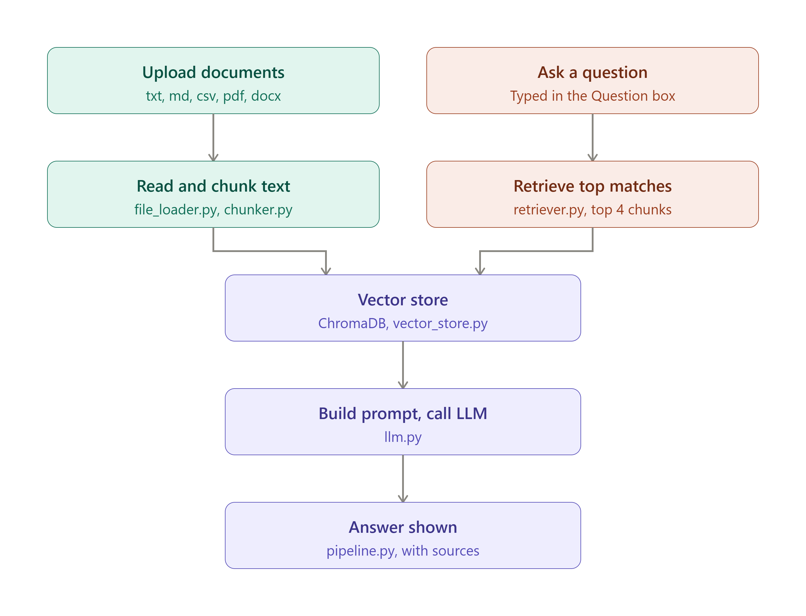

# AI PM Assistant — A Retrieval-Augmented Generation System for Product Management Workflows

## Abstract

Product Managers routinely operate across a fragmented set of unstructured documents — Product Requirements Documents (PRDs), meeting notes, and issue-tracker exports (e.g., Jira). Extracting specific facts, cross-referencing decisions, or auditing risks across these sources is manual and error-prone. This project implements a lightweight **Retrieval-Augmented Generation (RAG)** system that indexes uploaded documents into a local vector store, retrieves the most semantically relevant passages for a user's natural-language question, and synthesizes a grounded answer via a Large Language Model (LLM), with source attribution to prevent hallucination.

The system is designed around three principles: **modularity** (each pipeline stage is an isolated, testable unit), **groundedness** (answers are constrained to retrieved context, with an explicit fallback when the answer isn't present), and **local-first operation** (embeddings and vector storage run entirely on-device, with the LLM call as the only external dependency).

---

## 1. Introduction

### 1.1 Problem Statement

PMs generate large volumes of semi-structured text: PRDs describing feature requirements, meeting notes recording decisions and action items, and ticket exports tracking implementation status. Answering a question like *"Which tickets are blocked, and why?"* currently requires manually re-reading multiple documents. This project addresses that gap with a question-answering interface backed by retrieval over the PM's own documents.

### 1.2 Approach

Rather than fine-tuning a model or relying on an LLM's parametric knowledge (which cannot know about a team's private documents and is prone to hallucination), this system uses RAG: relevant text is retrieved from a vector database at query time and injected into the LLM's context window as grounding evidence. The LLM is explicitly instructed to answer only from the provided context, and to say so if the answer isn't present — a design choice validated during testing (see Section 6).

---

## 2. System Architecture

*Figure 1: End-to-end architecture of the AI PM Assistant, showing the indexing pipeline (document → chunks → vector store) and the query pipeline (question → retrieval → prompt construction → LLM → grounded answer).*

The system consists of two pipelines that share a common vector store:

**Indexing Pipeline:**

Upload document → Extract raw text → Chunk text → Embed chunks → Store in ChromaDB

**Query Pipeline:**

User question → Embed question → Retrieve top-K similar chunks → Construct grounded prompt → Call LLM → Return answer + sources

### 2.1 Design Rationale

| Decision | Rationale |
|---|---|
| Chunking with overlap | Prevents semantically meaningful sentences from being split across chunk boundaries and losing context |
| Local embedding model (`all-MiniLM-L6-v2`) | No network dependency for the embedding step; fast enough for interactive use; small enough to run on CPU |
| ChromaDB (persistent, local) | Zero-ops vector store — no external database to provision, data persists between sessions |
| Explicit "answer only from context" instruction | Reduces hallucination risk by constraining the LLM's generation to retrieved evidence |
| Modular file structure | Each pipeline stage (loading, chunking, embedding, retrieval, generation) is independently testable and swappable |

---

## 3. Tech Stack

| Layer | Technology |
|---|---|
| UI | [Gradio](https://www.gradio.app/) |
| Vector Database | [ChromaDB](https://www.trychroma.com/) (persistent local client) |
| Embedding Model | `sentence-transformers/all-MiniLM-L6-v2` |
| LLM Provider | OpenAI (`gpt-4o-mini` default) or Google Gemini (`gemini-1.5-flash` default) |
| Document Parsing | `pypdf` (PDF), `python-docx` (DOCX), native text parsing (TXT/MD/CSV) |
| Language | Python 3.10+ |

---

## 4. Project Structure

AI-PM-Assistant-using-RAG/
├── main/
│   ├── app.py            # Gradio UI — upload, index, ask, display answer
│   ├── config.py         # Central configuration (chunk size, top-k, model names)
│   ├── file_loader.py    # Document parsing (txt/md/csv/pdf/docx → plain text)
│   ├── chunker.py        # Overlapping text chunking
│   ├── vector_store.py   # ChromaDB client, collection, and clear_collection()
│   ├── indexer.py        # Orchestrates: read file → chunk → embed → store
│   ├── retriever.py      # Orchestrates: question → embed → query → top-K context
│   ├── llm.py            # Prompt construction + LLM API call (OpenAI/Gemini)
│   └── pipeline.py       # Full query flow: question → retrieve → prompt → answer
├── demo_document.txt      # Sample PRD + meeting notes + Jira export for demoing
├── demo_questions.txt     # Curated question set covering retrieval, summarization, and grounding checks
├── assets/
│   ├── architecture.png   # System architecture diagram
│   └── ui_demo.png        # UI screenshot
└── README.md

