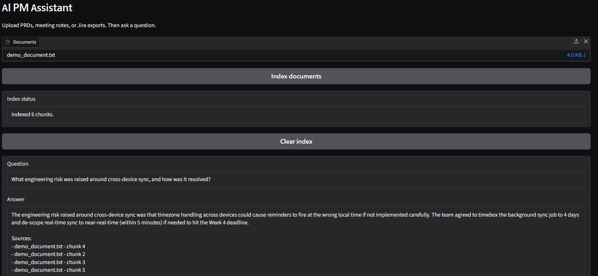

# AI PM Assistant — A Retrieval-Augmented Generation System for Product Management Workflows

## Abstract

Product Managers routinely operate across a fragmented set of unstructured documents — Product Requirements Documents (PRDs), meeting notes, and issue-tracker exports (e.g., Jira). Extracting specific facts, cross-referencing decisions, or auditing risks across these sources is manual and error-prone. This project implements a lightweight **Retrieval-Augmented Generation (RAG)** system that indexes uploaded documents into a local vector store, retrieves the most semantically relevant passages for a user's natural-language question, and synthesizes a grounded answer via a Large Language Model (LLM), with source attribution to prevent hallucination.

The system is designed around three principles: **modularity** (each pipeline stage is an isolated, testable unit), **groundedness** (answers are constrained to retrieved context, with an explicit fallback when the answer isn't present), and **local-first operation** (embeddings and vector storage run entirely on-device, with the LLM call as the only external dependency).

---

## 1. Introduction

### 1.1 Problem Statement

PMs generate large volumes of semi-structured text: PRDs describing feature requirements, meeting notes recording decisions and action items, and ticket exports tracking implementation status. Answering a question like *"Which tickets are blocked, and why?"* currently requires manually re-reading multiple documents. This project addresses that gap with a question-answering interface backed by retrieval over the PM's own documents.

### 1.2 Approach

Rather than fine-tuning a model or relying on an LLM's parametric knowledge (which cannot know about a team's private documents and is prone to hallucination), this system uses RAG: relevant text is retrieved from a vector database at query time and injected into the LLM's context window as grounding evidence. The LLM is explicitly instructed to answer only from the provided context, and to say so if the answer isn't present — a design choice validated during testing (see Section 6).

---

## 2. System Architecture


*Figure 1: End-to-end architecture of the AI PM Assistant, showing the indexing pipeline (document → chunks → vector store) and the query pipeline (question → retrieval → prompt construction → LLM → grounded answer).*

The system consists of two pipelines that share a common vector store:

**Indexing Pipeline:**

Upload document → Extract raw text → Chunk text → Embed chunks → Store in ChromaDB

**Query Pipeline:**

User question → Embed question → Retrieve top-K similar chunks → Construct grounded prompt → Call LLM → Return answer + sources

### 2.1 Design Rationale

| Decision | Rationale |
|---|---|
| Chunking with overlap | Prevents semantically meaningful sentences from being split across chunk boundaries and losing context |
| Local embedding model (`all-MiniLM-L6-v2`) | No network dependency for the embedding step; fast enough for interactive use; small enough to run on CPU |
| ChromaDB (persistent, local) | Zero-ops vector store — no external database to provision, data persists between sessions |
| Explicit "answer only from context" instruction | Reduces hallucination risk by constraining the LLM's generation to retrieved evidence |
| Modular file structure | Each pipeline stage (loading, chunking, embedding, retrieval, generation) is independently testable and swappable |

---

## 3. Tech Stack

| Layer | Technology |
|---|---|
| UI | [Gradio](https://www.gradio.app/) |
| Vector Database | [ChromaDB](https://www.trychroma.com/) (persistent local client) |
| Embedding Model | `sentence-transformers/all-MiniLM-L6-v2` |
| LLM Provider | OpenAI (`gpt-4o-mini` default) or Google Gemini (`gemini-1.5-flash` default) |
| Document Parsing | `pypdf` (PDF), `python-docx` (DOCX), native text parsing (TXT/MD/CSV) |
| Language | Python 3.10+ |

---

## 4. Project Structure

```
AI-PM-Assistant-using-RAG/
├── main/
│   ├── app.py            # Gradio UI — upload, index, ask, display answer
│   ├── config.py         # Central configuration (chunk size, top-k, model names)
│   ├── file_loader.py    # Document parsing (txt/md/csv/pdf/docx → plain text)
│   ├── chunker.py        # Overlapping text chunking
│   ├── vector_store.py   # ChromaDB client, collection, and clear_collection()
│   ├── indexer.py        # Orchestrates: read file → chunk → embed → store
│   ├── retriever.py      # Orchestrates: question → embed → query → top-K context
│   ├── llm.py            # Prompt construction + LLM API call (OpenAI/Gemini)
│   └── pipeline.py       # Full query flow: question → retrieve → prompt → answer
├── demo_document.txt      # Sample PRD + meeting notes + Jira export for demoing
├── demo_questions.txt     # Curated question set covering retrieval, summarization, and grounding checks
├── DEMO.md                # Expected answers and walkthrough for the demo questions
├── assets/
│   ├── architecture.png   # System architecture diagram
│   └── ui_demo.png        # UI screenshot
└── README.md
```

---

## 5. Installation & Setup

### 5.1 Prerequisites
- Python 3.10 or higher
- (Optional) An OpenAI or Google Gemini API key for answer generation

### 5.2 Steps

```bash
# 1. Clone the repository
git clone https://github.com/<your-username>/AI-PM-Assistant-using-RAG.git
cd AI-PM-Assistant-using-RAG/main

# 2. Create and activate a virtual environment
python -m venv venv
source venv/bin/activate        # Windows: venv\Scripts\activate

# 3. Install dependencies
pip install -r requirements.txt

# 4. (Optional) Set an LLM API key
export OPENAI_API_KEY="sk-..."
# or
export GEMINI_API_KEY="..."

# 5. Launch the app
python app.py
```

The app will be available locally at `http://127.0.0.1:7860`.

> **Note:** If no API key is set, the system falls back to displaying the raw retrieved context instead of a generated answer — retrieval still works fully offline; only the generation step requires an API key.

---

## 6. Usage & Demo



*Figure 2: The Gradio interface — document upload and indexing controls (top), question input and generated answer with source attribution (bottom).*

### 6.1 Workflow
1. Upload one or more documents (`.txt`, `.md`, `.csv`, `.pdf`, `.docx`) via the **Documents** panel.
2. Click **Index documents** — the app reports how many chunks were created and stored.
3. Enter a natural-language question in the **Question** field.
4. Click **Ask** — the system retrieves relevant chunks, constructs a grounded prompt, and returns an answer with a list of source chunks it drew from.
5. Click **Clear index** at any point to wipe the vector store and start fresh.

### 6.2 Try It Yourself

A ready-made demo is included:
1. Upload `demo_document.txt` (a sample PRD combined with meeting notes and a Jira export) and index it.
2. Ask any question from `demo_questions.txt`, which is organized into four categories:
   - **Simple fact lookup** — tests basic retrieval accuracy
   - **Summarization** — tests synthesis across a document section
   - **Multi-fact reasoning** — tests connecting information across sections
   - **Grounding checks** — questions with no answer in the document, to verify the system says "I don't know" instead of hallucinating
3. See [DEMO.md](DEMO.md) for expected answers and what each question is designed to test

---

## 7. Configuration

All tunable parameters live in `config.py`:

| Parameter | Default | Description |
|---|---|---|
| `CHUNK_SIZE` | 900 | Maximum characters per chunk |
| `CHUNK_OVERLAP` | 150 | Character overlap between consecutive chunks, to preserve context across boundaries |
| `TOP_K` | 4 | Number of chunks retrieved per query |
| `EMBEDDING_MODEL` | `all-MiniLM-L6-v2` | Sentence-transformers model used to generate embeddings |

These defaults were chosen as a reasonable starting point for short-to-medium PM documents (PRDs, meeting notes); larger source documents may benefit from a larger `CHUNK_SIZE` or higher `TOP_K`.

---

## 8. Evaluation

Manual evaluation was performed using the included demo document and question set (`demo_questions.txt`), covering three failure modes RAG systems commonly exhibit:

1. **Retrieval failure** (relevant chunk not retrieved) — mitigated by chunk overlap and `TOP_K` tuning.
2. **Hallucination** (answer not grounded in retrieved context) — mitigated by explicit prompt instruction to answer "only from the context below," with an instruction to state uncertainty otherwise.
3. **Silent failure on out-of-scope questions** — verified the system correctly responds with an "I don't know" style answer for questions with no support in the source document, rather than fabricating a plausible-sounding response.

All three cases were validated against the demo document prior to release.

---

## 9. Limitations

- **No OCR support** — scanned/image-based PDFs will return empty or garbled text, since extraction relies on embedded text layers.
- **No re-ranking step** — retrieval relies solely on embedding similarity; a cross-encoder re-ranking stage could improve precision for ambiguous queries.
- **Single-turn Q&A** — the system does not currently maintain conversational history across questions.
- **No automated evaluation suite** — evaluation is currently manual; no quantitative retrieval metrics (e.g., recall@k) are tracked yet.

---

## 10. Roadmap

- [ ] Add OCR fallback for scanned PDFs
- [ ] Add conversational memory across turns
- [ ] Add automated retrieval evaluation (recall@k on a labeled question set)
- [ ] Deploy to Hugging Face Spaces
- [ ] Add a cross-encoder re-ranking step for higher-precision retrieval

---

## 11. Contributing

Issues and pull requests are welcome. Please open an issue describing the proposed change before submitting a PR for anything beyond a minor fix.

---

## 12. License

See [LICENSE](LICENSE).

---

## Acknowledgments

Built using [Gradio](https://www.gradio.app/), [ChromaDB](https://www.trychroma.com/), and [Sentence-Transformers](https://www.sbert.net/).