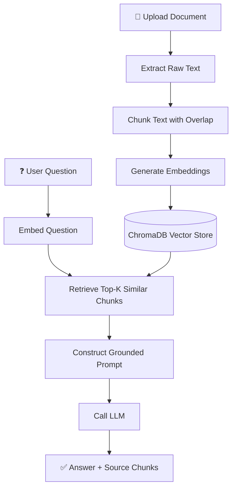
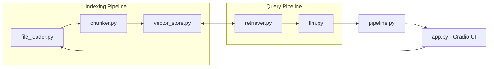

# AI PM Assistant — Retrieval-Augmented Generation System

> An AI-powered assistant that lets Product Managers ask natural-language questions directly against their own PRDs, meeting notes, and Jira exports — with grounded, source-attributed answers.

<!-- 📸 Placeholder: Hero banner / architecture teaser image -->
<!-- assets/hero_banner.png -->

---

## Table of Contents

1. [Overview](#1-overview)
2. [Problem & Motivation](#2-problem--motivation)
3. [Features](#3-features)
4. [Workflow](#4-workflow)
5. [Architecture](#5-architecture)
6. [Tech Stack](#6-tech-stack)
7. [Project Structure](#7-project-structure)
8. [Examples](#8-examples)
9. [Results & Evaluation](#9-results--evaluation)
10. [Setup & Installation](#10-setup--installation)
11. [Testing](#11-testing)
12. [Docker](#12-docker)
13. [CI/CD](#13-cicd)
14. [Limitations](#14-limitations)
15. [Future Improvements](#15-future-improvements)
16. [License](#16-license)

---

## 1. Overview

Product Managers work across a fragmented set of unstructured documents — PRDs, meeting notes, and issue-tracker exports. This project is a lightweight **Retrieval-Augmented Generation (RAG)** system that indexes those documents into a local vector store, retrieves the most relevant passages for a natural-language question, and generates a grounded, source-cited answer via an LLM.

The system is built around three principles:

| Principle | Meaning |
|---|---|
| **Modularity** | Each pipeline stage is an isolated, independently testable unit |
| **Groundedness** | Answers are constrained to retrieved context; the system explicitly says "not found" when the answer isn't present |
| **Local-first** | Embeddings and vector storage run entirely on-device; the LLM call is the only external dependency |

---

## 2. Problem & Motivation

Answering a question like *"Which tickets are blocked, and why?"* currently means manually re-reading multiple documents — slow, error-prone, and hard to scale across a growing document set.

Rather than fine-tuning a model (expensive, static) or relying on an LLM's parametric knowledge (prone to hallucination, blind to private team documents), this project uses **RAG**: relevant text is retrieved from a vector database at query time and injected into the LLM's context window as grounding evidence, with an explicit instruction to answer only from that evidence.

---

## 3. Features

- 🔍 **Semantic search** over uploaded documents using vector embeddings
- 📄 **Multi-format ingestion** — TXT, MD, CSV, PDF, DOCX
- 🤖 **Grounded LLM answers** with explicit source-chunk attribution
- 🧩 **Modular pipeline** — swap any stage independently (embedding model, LLM provider, vector store)
- 🧹 **Index management** — clear/reset the vector store from the UI
- 🚫 **Hallucination-resistant** — verified to correctly abstain when the answer isn't in the document
- 🐳 **Containerized** for reproducible deployment

---

## 4. Workflow

```mermaid
flowchart TD
    A[📄 Upload Document] --> B[Extract Raw Text]
    B --> C[Chunk Text with Overlap]
    C --> D[Generate Embeddings]
    D --> E[(ChromaDB Vector Store)]

    Q[❓ User Question] --> F[Embed Question]
    F --> G[Retrieve Top-K Similar Chunks]
    E --> G
    G --> H[Construct Grounded Prompt]
    H --> I[Call LLM]
    I --> J[✅ Answer + Source Chunks]
```

<!-- 📸 Placeholder: Optional custom workflow illustration -->
<!-- assets/workflow_custom.png -->

---

## 5. Architecture

```mermaid
flowchart LR
    subgraph Indexing Pipeline
        A1[file_loader.py] --> A2[chunker.py]
        A2 --> A3[vector_store.py]
    end

    subgraph Query Pipeline
        B1[retriever.py] --> B2[llm.py]
    end

    A3 <--> B1
    B2 --> B3[pipeline.py]
    B3 --> C[app.py - Gradio UI]
    C --> A1
```

<!-- 📸 Placeholder: Custom architecture diagram -->
<!-- assets/architecture.png -->

### Design Rationale

| Decision | Rationale |
|---|---|
| Chunking with overlap | Prevents meaningful sentences from being split across chunk boundaries |
| Local embedding model (`all-MiniLM-L6-v2`) | No network dependency; fast on CPU |
| ChromaDB (persistent, local) | Zero-ops vector store, persists between sessions |
| "Answer only from context" prompt constraint | Reduces hallucination risk |
| Modular file structure | Each stage independently testable and swappable |

---