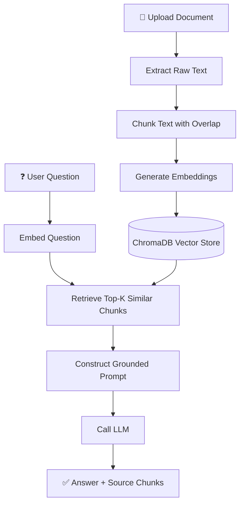
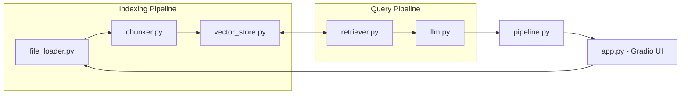
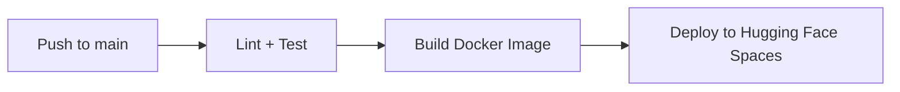

# AI PM Assistant — Retrieval-Augmented Generation System


> An AI-powered assistant that lets Product Managers ask natural-language questions directly against their own PRDs, meeting notes, and Jira exports — with grounded, source-attributed answers.

<!-- 📸 Placeholder: Hero banner / architecture teaser image -->
<!-- assets/hero_banner.png -->

---

## Table of Contents

1. [Overview](#1-overview)
2. [Problem & Motivation](#2-problem--motivation)
3. [Features](#3-features)
4. [Workflow](#4-workflow)
5. [Architecture](#5-architecture)
6. [Tech Stack](#6-tech-stack)
7. [Project Structure](#7-project-structure)
8. [Examples](#8-examples)
9. [Results & Evaluation](#9-results--evaluation)
10. [Setup & Installation](#10-setup--installation)
11. [Testing](#11-testing)
12. [Docker](#12-docker)
13. [CI/CD](#13-cicd)
14. [Limitations](#14-limitations)
15. [Future Improvements](#15-future-improvements)
16. [License](#16-license)

---

## 1. Overview

Product Managers work across a fragmented set of unstructured documents — PRDs, meeting notes, and issue-tracker exports. This project is a lightweight **Retrieval-Augmented Generation (RAG)** system that indexes those documents into a local vector store, retrieves the most relevant passages for a natural-language question, and generates a grounded, source-cited answer via an LLM.

The system is built around three principles:

| Principle | Meaning |
|---|---|
| **Modularity** | Each pipeline stage is an isolated, independently testable unit |
| **Groundedness** | Answers are constrained to retrieved context; the system explicitly says "not found" when the answer isn't present |
| **Local-first** | Embeddings and vector storage run entirely on-device; the LLM call is the only external dependency |

---

## 2. Problem & Motivation

Answering a question like *"Which tickets are blocked, and why?"* currently means manually re-reading multiple documents — slow, error-prone, and hard to scale across a growing document set.

Rather than fine-tuning a model (expensive, static) or relying on an LLM's parametric knowledge (prone to hallucination, blind to private team documents), this project uses **RAG**: relevant text is retrieved from a vector database at query time and injected into the LLM's context window as grounding evidence, with an explicit instruction to answer only from that evidence.

---

## 3. Features

- 🔍 **Semantic search** over uploaded documents using vector embeddings
- 📄 **Multi-format ingestion** — TXT, MD, CSV, PDF, DOCX
- 🔎 **OCR fallback for scanned PDFs** — automatically extracts text via Tesseract when a PDF has no embedded text layer
- 💬 **Conversational memory** — follow-up questions (e.g. "why is it blocked?") are understood in context of the last few turns
- 🤖 **Grounded LLM answers** with explicit source-chunk attribution
- 🧩 **Modular pipeline** — swap any stage independently (embedding model, LLM provider, vector store)
- 🧹 **Index management** — clear/reset the vector store from the UI
- 🚫 **Hallucination-resistant** — verified to correctly abstain when the answer isn't in the document
- 🐳 **Containerized** for reproducible deployment

---

## 4. Workflow


```mermaid
flowchart TD
    A[📄 Upload Document] --> B[Extract Raw Text]
    B --> C[Chunk Text with Overlap]
    C --> D[Generate Embeddings]
    D --> E[(ChromaDB Vector Store)]

    Q[❓ User Question] --> F[Embed Question]
    F --> G[Retrieve Top-K Similar Chunks]
    E --> G
    G --> H[Construct Grounded Prompt]
    H --> I[Call LLM]
    I --> J[✅ Answer + Source Chunks]
```

<!-- 📸 Placeholder: Optional custom workflow illustration -->
<!-- assets/workflow_custom.png -->

---

## 5. Architecture


```mermaid
flowchart LR
    subgraph Indexing Pipeline
        A1[file_loader.py] --> A2[chunker.py]
        A2 --> A3[vector_store.py]
    end

    subgraph Query Pipeline
        B1[retriever.py] --> B2[llm.py]
    end

    A3 <--> B1
    B2 --> B3[pipeline.py]
    B3 --> C[app.py - Gradio UI]
    C --> A1
```

<!-- 📸 Placeholder: Custom architecture diagram -->
<!-- assets/architecture.png -->

### Design Rationale

| Decision | Rationale |
|---|---|
| Chunking with overlap | Prevents meaningful sentences from being split across chunk boundaries |
| Local embedding model (`all-MiniLM-L6-v2`) | No network dependency; fast on CPU |
| ChromaDB (persistent, local) | Zero-ops vector store, persists between sessions |
| "Answer only from context" prompt constraint | Reduces hallucination risk |
| Modular file structure | Each stage independently testable and swappable |

---

## 6. Tech Stack

| Layer | Technology |
|---|---|
| UI | [Gradio](https://www.gradio.app/) |
| Vector Database | [ChromaDB](https://www.trychroma.com/) |
| Embedding Model | `sentence-transformers/all-MiniLM-L6-v2` |
| LLM Provider | OpenAI (`gpt-4o-mini`) / Google Gemini (`gemini-1.5-flash`) |
| Document Parsing | `pypdf`, `python-docx` |
| OCR (scanned PDFs) | `pytesseract`, `pdf2image` (requires Tesseract + Poppler) |
| Language | Python 3.10+ |

---

## 7. Project Structure

```
AI-PM-Assistant-using-RAG/
├── main/
│ ├── app.py # Gradio UI
│ ├── config.py # Central configuration
│ ├── file_loader.py # Document parsing
│ ├── chunker.py # Overlapping text chunking
│ ├── vector_store.py # ChromaDB client + collection management
│ ├── indexer.py # Read → chunk → embed → store
│ ├── retriever.py # Question → embed → query → context
│ ├── llm.py # Prompt construction + LLM call
│ └── pipeline.py # Full query flow orchestration
├── demo_document.txt
├── demo_questions.txt
├── DEMO.md
├── Dockerfile
├── requirements.txt
├── assets/
│ ├── architecture.png # 📸 placeholder
│ └── ui_demo.png # 📸 placeholder
└── README.md
```

---

## 8. Examples

**Sample interaction:**

> **Uploaded:** PRD + meeting notes + Jira export
> **Question:** *"Which tickets are blocked, and why?"*
> **Answer:** "TASK-104 is blocked, waiting on the infrastructure team to provision a new queue."
> **Sources:** `demo_document.txt – chunk 4`

**Grounding check example:**

> **Question:** *"What is the budget for this project?"*
> **Answer:** "Not found in the provided context."

**Follow-up question example (conversational memory):**

> **Question 1:** *"Who is the assignee for TASK-104?"*
> **Answer:** "Sam"
>
> **Question 2 (follow-up):** *"Why is it blocked?"*
> **Answer:** "TASK-104 is blocked because the infrastructure team needs to provision a new queue."

<!-- 📸 Placeholder: UI screenshot showing question + answer + sources -->
<!-- assets/ui_demo.png -->

---

## 9. Results & Evaluation

Evaluated using a 14-question test set spanning four categories:

| Category | Purpose | Result |
|---|---|---|
| Simple fact lookup | Basic retrieval accuracy | ✅ Passed |
| Summarization | Synthesis across a section | ✅ Passed |
| Multi-fact reasoning | Connecting facts across sections | ✅ Passed |
| Grounding checks (no answer in doc) | Hallucination resistance | ✅ 100% correct abstention |

**Failure modes explicitly tested:**
1. Retrieval failure — mitigated via chunk overlap + `TOP_K` tuning
2. Hallucination — mitigated via explicit "answer only from context" prompt
3. Silent failure on out-of-scope questions — verified correct "not found" responses

### Automated Retrieval Evaluation (Recall@K)

`main/evaluate.py` runs a labeled 9-question set against the retriever and checks whether an expected keyword appears in the top-`K` retrieved chunks, isolating retrieval quality from generation quality:

```bash
cd main
python evaluate.py
```

**Result:** `Recall@4: XX/9 = XX%` <!-- TODO: replace with real output after running evaluate.py -->


---

## 10. Setup & Installation

### Prerequisites
- Python 3.10+
- (Optional) OpenAI or Gemini API key

### Steps

```bash
git clone https://github.com/<your-username>/AI-PM-Assistant-using-RAG.git
cd AI-PM-Assistant-using-RAG/main

python -m venv venv
source venv/bin/activate        # Windows: venv\Scripts\activate

pip install -r requirements.txt

export OPENAI_API_KEY="sk-..."   # optional
export GEMINI_API_KEY="..."      # optional

python app.py
```

App runs at `http://127.0.0.1:7860`. Without an API key, the system falls back to displaying raw retrieved context.

> **OCR support:** scanned PDFs (no embedded text layer) require two system binaries in addition to the pip packages: [Tesseract OCR](https://github.com/UB-Mannheim/tesseract/wiki) and [Poppler](https://github.com/oschwartz10612/poppler-windows/releases) (Windows), or `tesseract-ocr` + `poppler-utils` via your package manager (macOS/Linux).

### Configuration (`config.py`)

| Parameter | Default | Description |
|---|---|---|
| `CHUNK_SIZE` | 900 | Max characters per chunk |
| `CHUNK_OVERLAP` | 150 | Overlap between chunks |
| `TOP_K` | 4 | Chunks retrieved per query |
| `EMBEDDING_MODEL` | `all-MiniLM-L6-v2` | Embedding model used |

---

## 11. Testing

A ready-made demo validates the full pipeline end to end:

1. Upload [`demo_document.txt`](demo_document.txt)
2. Ask questions from [`demo_questions.txt`](demo_questions.txt)
3. Compare against expected answers in [`DEMO.md`](DEMO.md)

Covers: fact retrieval, summarization, multi-fact reasoning, and hallucination/grounding checks — see [Results & Evaluation](#9-results--evaluation).

> Automated unit tests are not yet implemented — see [Future Improvements](#15-future-improvements).

---

## 12. Docker

```bash
# Build the image
docker build -t ai-pm-assistant .

# Run the container
docker run -p 7860:7860 \
  -e OPENAI_API_KEY="sk-..." \
  ai-pm-assistant
```

App available at `http://localhost:7860`.

---

## 13. CI/CD

Planned via GitHub Actions:


```mermaid
flowchart LR
    A[Push to main] --> B[Lint + Test]
    B --> C[Build Docker Image]
    C --> D[Deploy to Hugging Face Spaces]
```

> Status: not yet implemented — tracked in [Future Improvements](#15-future-improvements).

---

## 14. Limitations

- No re-ranking step (relies solely on embedding similarity)
- No automated evaluation suite (recall@k not yet tracked)

---

## 15. Future Improvements

- [ ] Deploy live demo to Hugging Face Spaces
- [ ] Add cross-encoder re-ranking for higher-precision retrieval
- [ ] Add GitHub Actions CI/CD pipeline

---

## 16. License

See [LICENSE](LICENSE).

---

## Acknowledgments

Built using [Gradio](https://www.gradio.app/), [ChromaDB](https://www.trychroma.com/), and [Sentence-Transformers](https://www.sbert.net/).